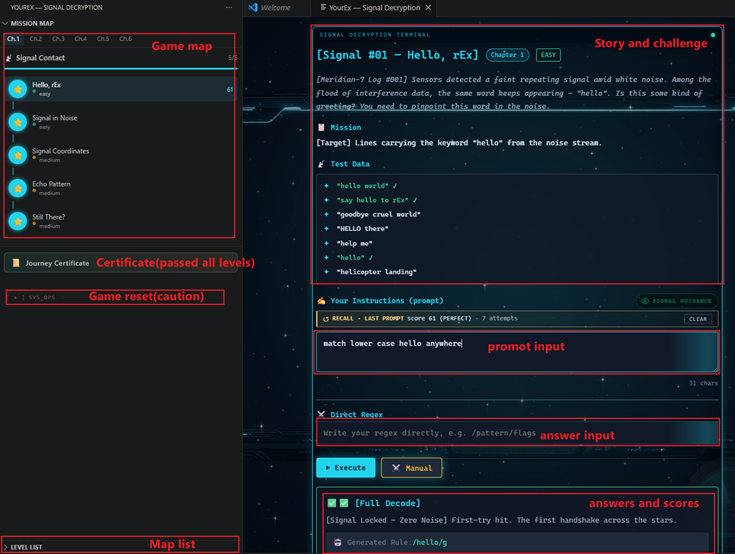
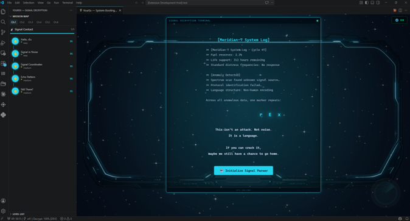
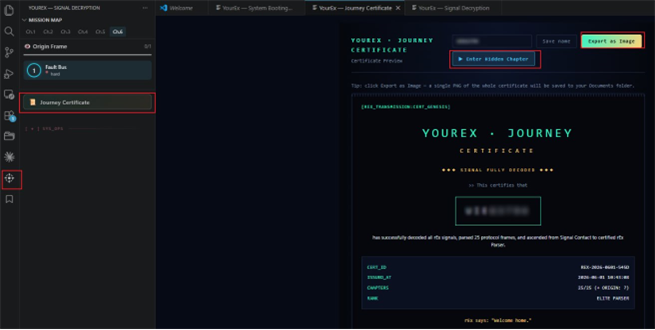
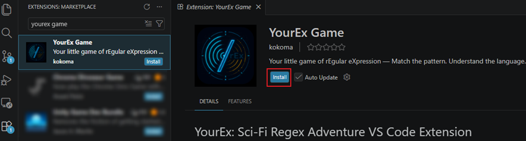

# YourEx: Sci-Fi Regex Adventure VS Code Extension

YourEx is a sci-fi themed interactive regex adventure for Visual Studio Code. Solve regex puzzles by crafting prompts for AI (or writing regex directly), unlock achievements, and explore a futuristic codex—all within your editor.



## How to Play

1. Each level presents a sci-fi story scenario and a regex challenge.
2. Write a **prompt** to instruct the AI to generate the correct regex — or type the regex directly.
3. The regex is evaluated against test data; match the expected lines to pass.
4. Progress through 6 chapters (26 levels) of increasing difficulty.
5. Between chapters, enjoy animated story interludes that advance the narrative.



6. Complete all levels to earn your **Journey Certificate**.



## Installation

### Prerequisites
- VS Code installed
- GitHub Copilot account available in VS Code (optional — needed only if you use prompt mode instead of writing regex directly)

### Steps



1. Install **"YourEx Game"** from the VS Code Extension Marketplace.
2. Click the **"YourEx Game"** icon in the left Activity Bar — the game starts.
3. If you choose to write prompts instead of regex, the extension will request GitHub Copilot access.

## Features
- **Interactive Regex Challenges**: Progress through story-driven levels with unique regex puzzles.
- **Hint System**: Get contextual hints and a one-time decrypt-all feature to help you advance.
- **Sci-Fi Codex Manual**: Access a comprehensive, in-universe regex reference manual from the Manual button.
- **Achievements & Leaderboard**: Track your progress, earn rewards, and compare scores.
- **User & Developer Modes**: Switch between standard play and developer mode for testing.
- **Internationalization (i18n)**: English and Chinese UI support.

## Development
- **Build extension:**
  ```sh
  npm run build
  ```
- **Run tests:**
  ```sh
  npm test
  ```
- **Build webview UI only:**
  ```sh
  npm run build:webview
  ```
- **Watch mode:**
  ```sh
  npm run watch
  ```

## Project Structure
- `src/` — Extension backend (TypeScript)
- `webview-ui/` — React webview UI (Vite, TypeScript)
- `prompt/` — Design docs, plans, and feature specs
- `test/` — Unit tests
- `resources/` — Icons and static assets

## Credits
- Developed by kokomaya
- Icon and sci-fi codex design by kokomaya

## License
[MIT](LICENSE)
